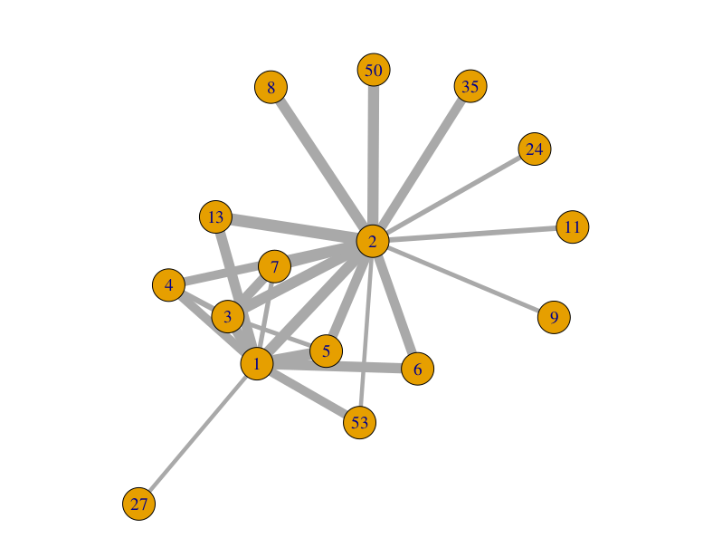

# PredictLikes - blogok "like-profil" alapján klaszterezése és a csoportosítás vizualizációja

A megadott adathalmazból kizárólag a `trainUsers.json` állományt használtunk fel a feladat megoldásához. 

A fájl tartalmából egy részlet:

```json
{"inTestSet": false, "uid": "34168956", "likes": [{"blog": "18164949", "post_id": "1740778", "like_dt": "2012-04-05 14:10:56"}]}
{"inTestSet": false, "uid": "7136386", "likes": [{"blog": "272", "post_id": "1340514", "like_dt": "2012-04-25 12:48:52"}]}
{"inTestSet": false, "uid": "684237", "likes": [{"blog": "336773", "post_id": "1943657", "like_dt": "2012-04-16 19:38:00"}]}
...
```
A sorok tehát az egyes felhasználók lájkolásait tartalmazzák.
Ami számunkra fontos az a `uid` tulajdonság (property) valamint a `likes` tulajdonság egyes elemeiből a `blog` azonosítók.

Először kinyerjük
MapReduce-szal azon blogpárokat melyeknek van közös lájkolójuk, és a pároshoz hozzárendeljük ezen lájkolók pontos számát.

- A Map fázisban minden felfedezett `(blog1, blog2)` kulcshoz egy egyest rendelünk. Mivel a bemeneti adat minden sora egy konkrét
felhasználó lájkolásait rögzíti, ha felhasználó n darab blogposztot lájkolt, a sor feldolgozása n*(n-1)/2 kulcs-érték pár emittálását
eredményezi. Fontos megjegyezni hogy ki kell kényszeríteni a kulcspárok elemeinek egyértelmű sorrendjét, hogy a Reduce fázisban történő
számlálások helyesen hajtódjanak végre, tehát ne történjen meg például a következő eset:
`(blog1, blog2), 1`
`(blog2, blog1), 1`

- A Reduce fázisban történik meg a kulcsok szerinti összegzés.

Végezetül egy olyan adatszerkezetet kapunk, amely egy olyan irányítatlan gráfot reprezentál, melynek csúcsai blogposztok, és két csúcs
között futó él súlya a csúcsok közös lájkjainak száma.

Az így keletkező adatmennyiség már kezelhető R-ben is. Az előbb említett gráfunkon az `igraph` gráfalgoritmusokat tartalmazó könyvtár `fastgreedy.community` algoritmusával közösségeket kerestünk, majd ezt vizualizáltuk az alábbi ábrán:



A gráfból töröltük a hurokéleket, mert jelentéktelenek a probléma szempontjából.

A csomópontok a közösségeket azonosítják, míg az élek vastagsága jelöli a két közösség közötti blogposzt-pár lájkolások nagyságát. Tehát egy, a vizualizáción megjelenő él súlya (vastagsága) a két közösségben lévő csomópontok között futó élek súlyainak összege. 

A közösség - blog id összerendelések meghatározhatóak `blogGroups.csv` fájlból.
